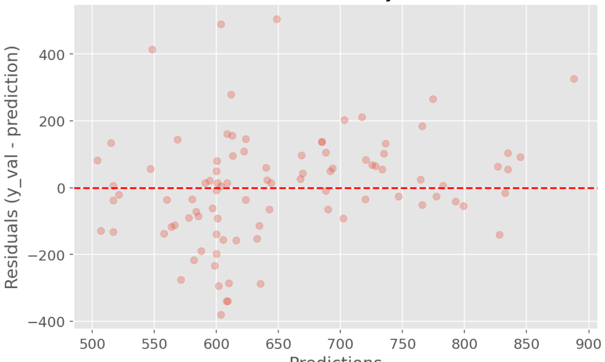
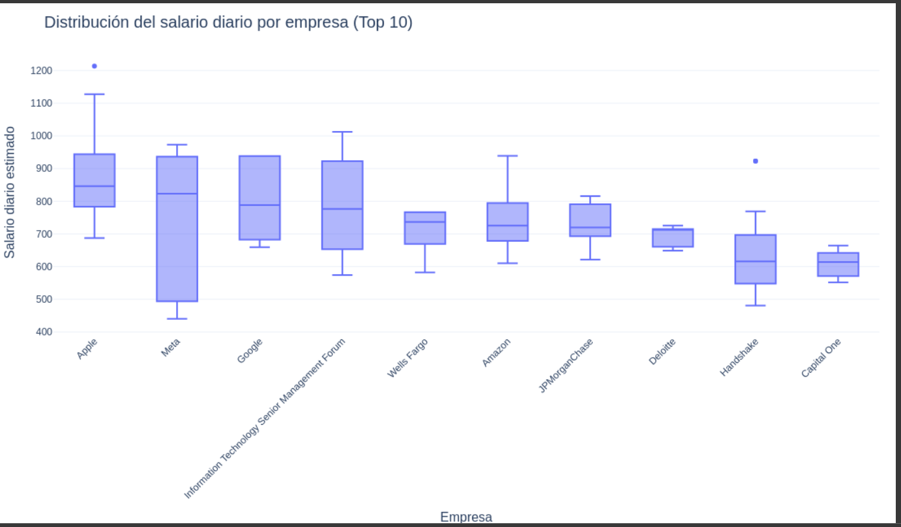
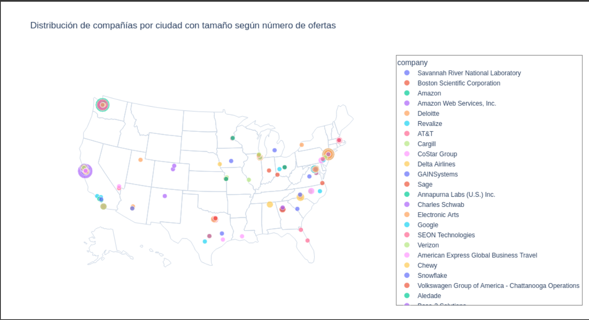
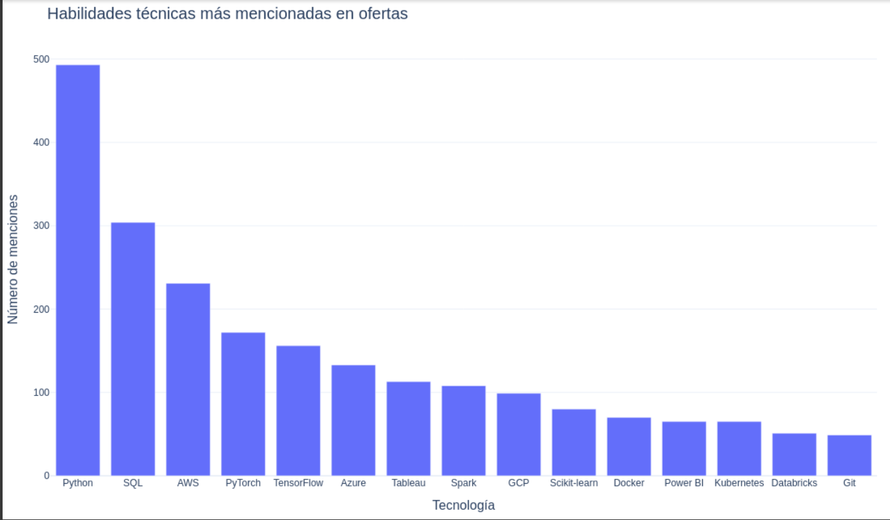
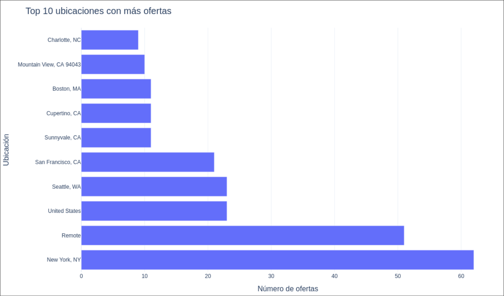

# Análisis de Empleos en Inteligencia Artificial (2025)

## Este proyecto analiza más de 700 ofertas reales en el sector de la Inteligencia Artificial y Ciencia de Datos, centrado en el mercado laboral de EE. UU. en 2025. Se exploran tendencias salariales, roles más demandados, patrones geográficos y se entrena un modelo predictivo basado en Random Forest.

---
> **Fuente de los datos:**  
> Dataset público de Kaggle: [**700+ JOBs Data of AI & Data Fields | 2025**](https://www.kaggle.com/datasets/princekhunt19/700-jobs-data-of-ai-and-data-fields-2025)  
> Recopilado por *Príncipe Khunt* — Licencia **DbCL v1.0**.

---
## Contenido del repositorio

- [Analisis_empleos_IA_2025_EDA_visualizaciones.ipynb](https://github.com/kumichin/Analisis-empleos-ia-2025/blob/main/Analisis_empleos_IA_2025_EDA_visualizaciones.ipynb): Notebook principal con el análisis exploratorio, visualizaciones y modelo.

- [Data/](https://github.com/kumichin/Analisis-empleos-ia-2025/tree/main/Data): Carpeta con un dataset adicional empleado para el mapa interactivo hecho con plotly.

- [img/](https://github.com/kumichin/Analisis-empleos-ia-2025/tree/main/img): Carpeta donde estan guardadas las graficas como archivos de imagen

- README.md: Este documento aclaratorio.


## Este análisis busca explorar las principales tendencias y patrones del mercado laboral en IA y Data Science durante 2025 intentando responder a las siguientes preguntas:

- ¿Qué ubicaciones geográficas concentran más oportunidades?

- ¿Cómo varían los salarios según la experiencia o la ubicación?

- ¿Qué habilidades técnicas son más demandadas?

- ¿Qué empresas lideran la contratación en IA y Data Science?

- ¿Qué compañías o sectores ofrecen los salarios más competitivos?

- ¿Qué roles específicos dentro del ámbito de IA y Data Science son mejor remunerados?

- Durante el proceso, también surgió la necesidad de abordar valores ausentes en variables clave, lo que motivó el uso de técnicas de modelado predictivo para imputación, enriqueciendo el análisis y permitiendo una exploración más completa de los datos.

---

## Herramientas utilizadas

- Python (pandas, numpy, matplotlib, plotly)

- Scikit-learn (RandomForestRegressor)

- RapidFuzz (para detección de nombres de empresa similares)

- Google colab

- Se instaló kaleido para que las gráficas interactivas de plotly se vieran en github (en instrucciones verás indicaciones de que hacer para poder interacturar con las gráficas)

--- 

## Instalación de dependencias necesarias:

### Se hizo necesario instalar dependencias en google colab (las celdas de instalacion se han dejado en la muestra final), tan solo instala (si es necesario en tu caso) rapidfuzz porque es necesario para la funcionalidad de una gráfica, Kaleido no es necesario instalarlo.

#### Este notebook tiene gráficas interactivas realizadas con plotly que permiten hacer zoom, filtrar e incluso dan información adicional al pasar el ratón por encima, para que se vieran en github tuve que modificar levemente el código y convertirlas en imagenes estáticas, en las celdas de las gráficas explico que hay que hacer para que recuperen la interactividad pero queria dejar aqui constancia.

#### Todas las celdas de código de las gráficas tienen algo asi en la parte final:

```python
# Para ver la gráfica interactiva localmente, en colab o similar,
# descomenta la siguiente línea y comenta la sección de imagen estática:

# fig.show()

# Guardar imagen para GitHub
pio.write_image(fig, "Top_10_ubicaciones_con_más_ofertas.png", format="png", width=1100, height=700)

# Mostrar imagen estática justo debajo
display(Image("Top_10_ubicaciones_con_más_ofertas.png"))

```
#### Es tal como lo dice el mismo comentario, debes de descomentar `fig.show()` y comentar `pio.write_image(fig, "Top_10_ubicaciones_con_más_ofertas.png", format="png", width=1100, height=700)` y `display(Image("Top_10_ubicaciones_con_más_ofertas.png"))` así aparece la interactividad y se va la imagen fija.


## Pruebas
Este proyecto no tiene tests automatizados, ya que es un análisis exploratorio Sin embargo puedes probar el modelo con nuevos datos de entrada para ver su eficacia con otros datos.


## Modelado

El modelo usado es random forest. Los pasos que seguí para su creación y entrenamiento fueron:

- Preparación y División de Datos

- Ingeniería y Codificación de Características (Feature Engineering)

- División Final de Datos para Entrenamiento y Validación

- Modelo de RandomForestRegressor

- Optimización de Hiperparámetros con RandomizedSearchCV

- Evaluación del Modelo

- Imputación de Salarios Faltantes con el modelo optimizado.

---

## Gráficas

> A continuación las visualizaciones del análisis. Recuerda que todas son interactivas en el notebook, aunque aquí se muestran en formato imagen estática por limitaciones de GitHub.

### Análisis residual del modelo



### Distribución salarial diaria por empresa (La base de datos esta llena de seniority, especializaciones muy técnicas...)


### Distribución de compañias por ciudad con tamaño según el número de ofertas (El tamaño de los circulos es directamente proporcional al número de ofertas)


### Habilidades más demandadas según esa base de datos


### Las 10 Ubicaciones con más ofertas de trabajo.



## Contribuyendo

Actualmente es un proyecto individual.
Si deseas sugerir mejoras o reutilizar parte del análisis, siéntete libre de abrir un issue o pull request.

---

## Licencia 📄

#### © 2025 Fátima I.S. Todos los derechos reservados.

Este repositorio se publica únicamente con fines educativos y de portafolio.

**No se permite el uso, copia, modificación ni redistribución del contenido sin autorización expresa de la autora.**

---

## Expresiones de Gratitud 

Si te gustó el análisis, dale una estrella al repo.

Menciona o comparte el proyecto si te resultó útil.

Comentarios y feedback siempre bienvenidos.


##  Referencias al Dataset usado

Dataset original:

Título: 700+ JOBs Data of AI & Data Fields | 2025

Autor: Prince Khunt

Fuente: Kaggle

Licencia: Database Contents License (DbCL) v1.0

Enlace: Ver en [Kaggle](https://www.kaggle.com/datasets/princekhunt19/700-jobs-data-of-ai-and-data-fields-2025)

